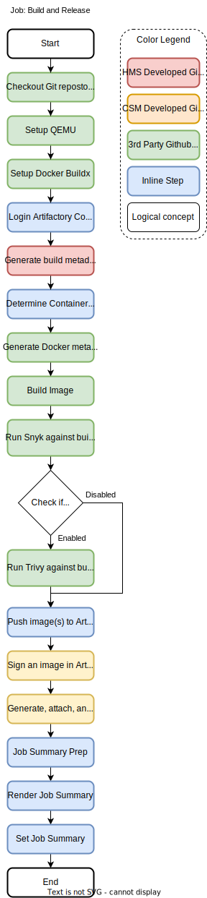

# hms-build-image-workflows

Table of contents
- [hms-build-image-workflows](#hms-build-image-workflows)
  - [Build and release image workflow](#build-and-release-image-workflow)
    - [Workflow Inputs](#workflow-inputs)
    - [Build and release job](#build-and-release-job)
    - [Update PR with comment job](#update-pr-with-comment-job)
    - [Full example](#full-example)
      - [Workflow to build image with standard Dockerfile name and build context.](#workflow-to-build-image-with-standard-dockerfile-name-and-build-context)
      - [Workflow to build image with non-standard Dockerfile name](#workflow-to-build-image-with-non-standard-dockerfile-name)
      - [Workflow to build image with non-standard build context](#workflow-to-build-image-with-non-standard-build-context)
      - [PR Comment Template](#pr-comment-template)
  - [Run unit test workflow](#run-unit-test-workflow)
    - [Workflow inputs](#workflow-inputs-1)
    - [Full example](#full-example-1)
  - [Run integration test workflow](#run-integration-test-workflow)
    - [Workflow inputs](#workflow-inputs-2)
    - [Full example](#full-example-2)
  - [Run ct test workflow](#run-ct-test-workflow)
    - [Workflow inputs](#workflow-inputs-3)
    - [Full example](#full-example-3)
  - [Release model](#release-model)


The hms-build-image-workflows repository contains Github Action workflows to facilitate the process of building container images and running unit and integration tests from HMS repositories.

## Build and release image workflow


The build and release image workflow located at `.github/workflows/build_and_release_image.yaml` in this repository will build container image from a Dockerfile and publish and sign the artifact in Artifactory.  Stable artifacts are produced when a commit is tagged. For all other pushes or PRs an unstable artifact is produced.

The workflow is composed to two jobs. 
1. The [Build and release job](#build-and-release-image-workflow) publishes and signs artifacts in Artifactory.
2. The [Update PR with comment job](#update-pr-with-comment-job) will run if the workflow was triggered from PR event, and will create or update a comment on the PR with links to artifacts produced by the workflow run.

Repository requirements:
* The application `Dockerfile` is located in the root directory of the repository.
* If `enable-pr-comment` is set to True, then it is expected that PR comment template is located at `.github/build-image-comment-template.md` within the repo.

### Workflow Inputs
| Name                   | Data Type | Required Field | Default value             | Description
| ---------------------- | --------- | -------------- | ------------------------- | -----------
| `runs-on`              | `string`  | Optional       | `ubuntu-latest`           | The type of machine to run the job on.
| `image-name`           | `string`  | Required       |                           | Container image name. For example, cray-firmware-action
| `docker-registry`      | `string`  | Optional       | `artifactory.algol60.net` | Registry to publish container images to.
| `docker-build-context` | `string`  | Optional       | `.`                       | Build's context is the set of files located in the specified PATH.
| `docker-build-file`    | `string`  | Optional       | `""`                      | Path to the Dockerfile. If set to the empty string it will default to `{docker-build-context}/Dockerfile`.
| `enable-latest-tag`    | `string`  | Optional       | `False`                   | Enable the latest tag for stable builds. Choose from true or false
| `snyk-severity`        | `string`  | Optional       | `high`                    | Only report vulnerabilities of provided level or higher. Choose from: low, medium, high, or critical
| `trivy-enable`         | `string`  | Optional       | `False`                   | Enable or disable the Trivy Vulnerability scanner. Choose from true or false
| `trivy-exit-code`      | `string`  | Optional       | `0`                       | Exit code when vulnerabilities were found
| `trivy-severity`       | `string`  | Optional       | `CRITICAL,HIGH`           | Severities of vulnerabilities to be displayed
| `enable-pr-comment`    | `string`  | Optional       | `True`                    | Control whether the update-pr-with-artifacts job runs on PR builds. Choose from true or false

### Build and release job




The build and release job performs the following high level actions:
1. Uses Docker to build the Dockerfile
2. Run Snyk (and Trivy if enabled) against the built container image to find vulnerabilities.
3. Push container image into correct location within Artifactory (either to stable or unstable)
4. Create Software Bill of Materials (SBOM) using Syft.

The build and release job is composed of various 3rd party and internally developed Github Actions.
- Internally developed Github Actions:
  - [Cray-HPE/hms-build-metadata-action/generate-build-metadata@v1](https://github.com/Cray-HPE/hms-build-metadata-action/tree/v1/generate-build-metadata)
  - [Cray-HPE/.github/actions/csm-sign-image@v2.0-csm-sign-image](https://github.com/Cray-HPE/.github/tree/main/actions/csm-sign-image)
  - [Cray-HPE/.github/actions/csm-generate-attach-sign-sbom@v1.0-csm-generate-attach-sign-sbom](https://github.com/Cray-HPE/.github/tree/main/actions/csm-generate-attach-sign-sbom)

- 3rd party Github Actions:
  - [actions/checkout@v2](https://github.com/actions/checkout/tree/v2)
  - [aquasecurity/trivy-action@master](https://github.com/aquasecurity/trivy-action)
  - [docker/build-push-action@v2](https://github.com/docker/build-push-action/tree/v2)
  - [docker/login-action@v1](https://github.com/docker/login-action/tree/v1)
  - [docker/metadata-action@v3](https://github.com/docker/metadata-action/tree/v3)
  - [docker/setup-buildx-action@v1](https://github.com/docker/setup-buildx-action/tree/v1)
  - [docker/setup-qemu-action@v1](https://github.com/docker/setup-qemu-action/tree/v1)
  - [snyk/actions/docker@master](https://github.com/snyk/actions/tree/master/docker)

### Update PR with comment job


The update PR with comment job only runs if the build and release workflow was triggered from a PR (include draft PRs), otherwise it is skipped. The purpose of this job is to make it easy to easily identify artifacts that were produced from the PR build run. With information to easily:
- Identify the image location with Artifactory.
- Steps to load the container images easily onto development systems.
- Retrieve the generated SBOM in SPDX format of the built container image.

The PR comment Markdown template is expected to exist at `.github/build-image-comment-template.md` inside of the Git repository calling this workflow. This template uses the [Golang templating language](https://pkg.go.dev/text/template) (note the `hmtl/template` package is being used to render the template instead of `text/template` but the documentation for `text/template` is still applicable).  


The following table shows what template variables are currently exposed by this job when a comment template is rendered:
| Variable          | Example                                                                                       |
| ----------------- | --------------------------------------------------------------------------------------------- |
| `image`           | `artifactory.algol60.net/csm-docker/unstable/cray-power-control:0.0.1-20220204191303.a2980b2` |
| `imageTag`        | `0.0.1-20220204191303.a2980b2`                                                                |
| `imageRepository` | `artifactory.algol60.net/csm-docker/stable/cray-power-control`                                | 
| `imageName`       | `cray-power-control`                                                                          |
| `stableString`    | `stable` or `unstable`                                                                        | 
| `PRHeadSha`       | `a2980b2`                                                                                     | 


The update PR with comment job is composed of mostly 3rd part Github Actions
- 3rd party Github Actions:
  - [actions/checkout@v2](https://github.com/actions/checkout/tree/v2)
  - [chuhlomin/render-template@v1.2](https://github.com/chuhlomin/render-template/tree/v1.2)
  - [peter-evans/find-comment@v1](https://github.com/peter-evans/find-comment/tree/v1)
  - [peter-evans/create-or-update-comment@v1](https://github.com/peter-evans/create-or-update-comment/tree/v1)

### Full example
#### Workflow to build image with standard Dockerfile name and build context.
Sample build and publish docker image workflow (`.github/workflows/build_and_release_image.yaml`) in use by the [hms-power-control repository](https://github.com/Cray-HPE/hms-power-control/blob/develop/.github/workflows/build_and_release_image.yaml). This assumes the Dockerfile is in the root of the repository, with the name `Dockerfile`.

**IMPORTANT** when creating or migrating a repository to use this workflow make sure that the value for `.jobs.build_and_release.with.image-name` is set to the desired image name for the container registry.
```yaml
name: Build and Publish Docker Image # Consider changing the workflow name to make it distinguishable from other flows.
on:
  - push # Perform a build of the contents from the branch
  - pull_request # Perform a build after merging with the target branch
  - workflow_dispatch
jobs:
  build_and_release:
    uses: Cray-HPE/hms-build-image-workflows/.github/workflows/build_and_release_image.yaml@v1
    with:
      image-name: cray-power-control # This is the only field that needs to be changed
      enable-pr-comment: true
    secrets:
      artifactory-username: ${{ secrets.ARTIFACTORY_ALGOL60_USERNAME }}
      artifactory-token: ${{ secrets.ARTIFACTORY_ALGOL60_TOKEN }}
      snyk-token: ${{ secrets.SNYK_TOKEN }}
      cosign-gcp-project-id: ${{ secrets.COSIGN_GCP_PROJECT_ID }}
      cosign-gcp-sa-key:  ${{ secrets.COSIGN_GCP_SA_KEY }}
      cosign-key: ${{ secrets.COSIGN_KEY }}
```

#### Workflow to build image with non-standard Dockerfile name
Sample build and publish docker image workflow to build a Dockerfile with a non-standard name. The example below will use the Dockerfile named `Dockerfile.hms-pytest` inside of the root of the repository.

**IMPORTANT** when creating or migrating a repository to use this workflow make sure that the value for `.jobs.build_and_release.with.image-name` is set to the desired image name for the container registry.
```yaml
name: Build and Publish Docker Image # Consider changing the workflow name to make it distinguishable from other flows.
on:
  - push # Perform a build of the contents from the branch
  - pull_request # Perform a build after merging with the target branch
  - workflow_dispatch
jobs:
  build_and_release:
    uses: Cray-HPE/hms-build-image-workflows/.github/workflows/build_and_release_image.yaml@v1
    with:
      image-name: hms-pytest # Adjust this to match the container image 
      docker-build-file: Dockerfile.hms-pytest # Adjust this to match the desired Dockerfile name
      enable-pr-comment: true
    secrets:
      artifactory-username: ${{ secrets.ARTIFACTORY_ALGOL60_USERNAME }}
      artifactory-token: ${{ secrets.ARTIFACTORY_ALGOL60_TOKEN }}
      snyk-token: ${{ secrets.SNYK_TOKEN }}
      cosign-gcp-project-id: ${{ secrets.COSIGN_GCP_PROJECT_ID }}
      cosign-gcp-sa-key:  ${{ secrets.COSIGN_GCP_SA_KEY }}
      cosign-key: ${{ secrets.COSIGN_KEY }} 
```

#### Workflow to build image with non-standard build context
Sample build and publish docker image workflow to build a Dockerfile with a non-standard build context. The example below will use the Dockerfile named `Dockerfile` inside of the directory `tests/ct`.

**IMPORTANT** when creating or migrating a repository to use this workflow make sure that the value for `.jobs.build_and_release.with.image-name` is set to the desired image name for the container registry.
```yaml
name: Build and Publish Docker Image # Consider changing the workflow name to make it distinguishable from other flows.
on:
  - push # Perform a build of the contents from the branch
  - pull_request # Perform a build after merging with the target branch
  - workflow_dispatch
jobs:
  build_and_release:
    uses: Cray-HPE/hms-build-image-workflows/.github/workflows/build_and_release_image.yaml@v1
    with:
      image-name: cray-power-control-test # Adjust this to match the container image 
      docker-build-context: tests/ct # Adjust this to match the desired Docker build context
      enable-pr-comment: true
    secrets:
      artifactory-username: ${{ secrets.ARTIFACTORY_ALGOL60_USERNAME }}
      artifactory-token: ${{ secrets.ARTIFACTORY_ALGOL60_TOKEN }}
      snyk-token: ${{ secrets.SNYK_TOKEN }}
      cosign-gcp-project-id: ${{ secrets.COSIGN_GCP_PROJECT_ID }}
      cosign-gcp-sa-key:  ${{ secrets.COSIGN_GCP_SA_KEY }}
      cosign-key: ${{ secrets.COSIGN_KEY }} 
```

#### PR Comment Template
Sample PR comment template (`.github/build-image-comment-template.md`) in use by the [hms-power-control repository](https://github.com/Cray-HPE/hms-power-control/blob/develop/.github/build-image-comment-template.md).
````markdown
<!-- This file is templated with https://pkg.go.dev/html/template -->
👋  Hey! Here is the image we built for you ([Artifactory Link](https://artifactory.algol60.net/ui/repos/tree/General/csm-docker%2F{{ .stableString }}%2F{{ .imageName }}%2F{{ .imageTag }})):

```bash
{{ .image }}
```

Use podman or docker to pull it down and inspect locally:

```bash
podman pull {{ .image }}
```

Or, use this script to pull the image from the build server to a dev system:

<details>
<summary>Dev System Pull Script</summary>
<br />

> **Note** the following script only applies to systems running CSM 1.2 or later.
```bash
#!/usr/bin/env bash
export REMOTE_IMAGE={{ .image }}
export LOCAL_IMAGE={{ .imageName }}:{{ .imageTag }}
skopeo copy --dest-tls-verify=false docker://${REMOTE_IMAGE} docker://registry.local/csm-docker/stable/${LOCAL_IMAGE}
```
</details>

<details>
<summary>Snyk Report</summary>
<br />

_Coming soon_

</details>

<details>
<summary>Software Bill of Materials</summary>
<br />

```bash
cosign download sbom {{ .image }} > container_image.spdx
```

If you don't have cosign, then you can get it [here](https://github.com/sigstore/cosign#installation).
</details>

*Note*: this SHA is the merge of {{ .PRHeadSha }} and the PR base branch. Good luck and make rocket go now! 🌮 🚀
````

This results in a PR comment that looks like:


## Run unit test workflow


The run unit test workflow `.github/workflows/run_unit_test.yaml` in this repository is designed to execute unit tests within a Github repository. This effectively runs `make unittest` in the root of the repository. 

Requirements:
- Makefile is present in the root of the repository.
- The Makefile has the `unittest` target defined to run the repositories unit tests.

The update PR with comment job is composed of mostly 3rd party Github Actions
- 3rd party Github Actions:
  - [actions/checkout@v2](https://github.com/actions/checkout/tree/v2)

### Workflow inputs
| Name      | Data Type | Required Field | Default value   | Description
| --------- | --------- | -------------- | --------------- | -----------
| `runs-on` | `string`  | Optional       | `ubuntu-latest` | The type of machine to run the job on.

### Full example

Sample run unit tests workflow (`.github/workflows/run_unit_test.yaml`) in use by the [hms-power-control repository](https://github.com/Cray-HPE/hms-power-control/blob/develop/.github/workflows/run_unit_test.yaml).
```yaml
name: Run Unit Tests
on: [push, pull_request, workflow_dispatch]
jobs:
  run_unit_test:
    uses: Cray-HPE/hms-build-image-workflows/.github/workflows/run_unit_test.yaml@v1
    with:
      runs-on: ubuntu-latest
```

Sample Makefile target in use by the [hms-power-control repository](https://github.com/Cray-HPE/hms-power-control/blob/develop/Makefile). The hms-power-control repository uses the `unittest` target to run the `runUnitTest.sh` script.
```makefile
unittest:
	./runUnitTest.sh
```

## Run integration test workflow


The run unit test workflow `.github/workflows/run_integration_test.yaml` in this repository is designed to execute unit tests within a Github repository. This effectively runs `make integration` in the root of the repository. 

Requirements:
- Makefile is present in the root of the repository.
- The Makefile has the `integration` target defined to run the repositories unit tests.

The update PR with comment job is composed of mostly 3rd part Github Actions
- 3rd party Github Actions:
  - [actions/checkout@v2](https://github.com/actions/checkout/tree/v2)

### Workflow inputs
| Name      | Data Type | Required Field | Default value   | Description
| --------- | --------- | -------------- | --------------- | -----------
| `runs-on` | `string`  | Optional       | `ubuntu-latest` | The type of machine to run the job on.

### Full example
Sample run unit tests workflow (`.github/workflows/run_integration_test.yaml`) in use by the [hms-power-control repository](https://github.com/Cray-HPE/hms-power-control/blob/develop/.github/workflows/run_integration_test.yaml).
```yaml
name: Run Integration Tests
on: [pull_request, workflow_dispatch]
jobs:
  run_integration_test:
    uses: Cray-HPE/hms-build-image-workflows/.github/workflows/run_integration_test.yaml@v1
    with:
      runs-on: ubuntu-latest
```

Sample Makefile target in use by the [hms-power-control repository](https://github.com/Cray-HPE/hms-power-control/blob/develop/Makefile). The hms-power-control repository uses the `integration` target to run the `runIntegration.sh` script.
```makefile
integration:
	./runIntegration.sh
```

## Run ct test workflow


The run ct test workflow `.github/workflows/run_ct_test.yaml` in this repository is designed to execute unit tests within a Github repository. This effectively runs `make ct` in the root of the repository. 

Requirements:
- Makefile is present in the root of the repository.
- The Makefile has the `ct` target defined to run the repositories unit tests.

The update PR with comment job is composed of mostly 3rd party Github Actions
- 3rd party Github Actions:
  - [actions/checkout@v2](https://github.com/actions/checkout/tree/v2)

### Workflow inputs
| Name      | Data Type | Required Field | Default value   | Description
| --------- | --------- | -------------- | --------------- | -----------
| `runs-on` | `string`  | Optional       | `ubuntu-latest` | The type of machine to run the job on.

### Full example

Sample run unit tests workflow (`.github/workflows/run_unit_test.yaml`) in use by the [hms-firmware-action repository](https://github.com/Cray-HPE/hms-firmware-action/blob/master/.github/workflows/run_ct_test.yaml).
```yaml
name: Run CT Tests
on: [push, pull_request, workflow_dispatch]
jobs:
  run_ct_test:
    uses: Cray-HPE/hms-build-image-workflows/.github/workflows/run_ct_test.yaml@v1
    with:
      runs-on: ubuntu-latest
```

Sample Makefile target in use by the [hms-firmware-action repository](https://github.com/Cray-HPE/hms-firmware-action/blob/master/Makefile). The hms-firmware-action repository uses the `ct` target to run the `runCT.sh` script.
```makefile
ct:
	./runCT.sh
```

## Release model

When you make changes you should tag the code branch with an vX.Y.Z semver and move/create the vX tag.

the vX tag (eg v1) is used by the 'invoking' workflows.  The contract is that vX(n) MUST be backwards compatible.  
the vX.Y.Z tag is used to distinguish code changes as a release.